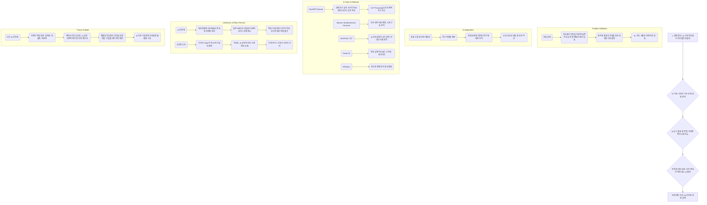

제공해주신 과제 목적과 내용을 바탕으로 귀하의 전공인 **기술경영**과 핵심 문제인 **양손잡이 리더십**에 초점을 맞춰 과제 각 섹션을 상세히 가이드해 드리겠습니다.

---

### **과제 목적에 대한 이해 (Overall Assignment Purpose)**
본 과제의 핵심 목적은 **AI 기반 전략적 의사결정의 흐름을 종합적으로 이해하고, 전공 분야에 맞는 AI 활용 전략을 구상하는 것**입니다 [서두]. 특히, AI의 기회와 한계를 균형 있게 파악하고, **AI와 인간이 함께하는 미래를 구체적으로 설계하는 능력**을 보여주는 것이 중요합니다 [서두]. 귀하의 기술경영 전공과 양손잡이 리더십 문제 정의는 이러한 AI 시대의 복잡한 의사결정 상황에 전략적 통찰을 제공하기에 매우 적합합니다.

---

### **1. 나의 학습 여정 회고 (Reflection on Learning Journey)**

각 주차별 핵심 키워드를 **기술경영**과 **양손잡이 리더십** 문제와 연결하여 서술하는 것이 중요합니다. 단순히 키워드를 나열하는 것을 넘어, 해당 개념이 귀하의 전공 분야에서 **어떤 의미를 가지며, 양손잡이 리더십과 같은 복합적인 의사결정 문제를 해결하는 데 어떻게 기여할 수 있는지**를 구체적으로 설명해야 합니다.

다음은 각 주차에서 중요 키워드와 기술경영 및 양손잡이 리더십과의 연관성을 제안하는 가이드입니다:

*   **1주차: AI와 전략적 의사결정**
    *   **키워드:** **인간과 AI의 협력**
    *   **기술경영 연결:** AI 시대에는 기술 혁신과 사업 지속성을 위한 전략적 의사결정 과정에서 인간의 직관, 윤리, 창의력이 AI의 분석력, 예측력과 **상호보완적 협력**을 이루는 것이 필수적입니다. 이는 양손잡이 리더십이 요구하는 탐색(exploration)과 활용(exploitation)의 균형을 AI의 데이터 기반 분석과 인간 리더의 맥락적 판단으로 달성하는 데 적용될 수 있습니다.
*   **2주차: 생성형 AI의 원리와 활용**
    *   **키워드:** **생성형 AI와 전략적 의사결정**
    *   **기술경영 연결:** 생성형 AI는 복잡한 데이터를 요약하고 정리하며, 다양한 시나리오와 전략 초안을 생성하는 데 유리하여 기술사업화 전략 수립에 인간의 **전략적 사고를 확장하는 도구**로 활용될 수 있습니다. 특히, 양손잡이 리더십 이론의 체계화 과정에서 다양한 이론적 내용과 실증적 사례를 탐색하고 종합하는 데 활용 가능합니다.
*   **3주차: 데이터 기반 의사결정 vs AI 기반 의사결정**
    *   **키워드:** **AI 기반 의사결정**
    *   **기술경영 연결:** 전통적인 데이터 기반 의사결정의 한계(비정형 데이터 활용 어려움, 실시간성 부족, 인간 해석 의존성 등)를 넘어, AI 기반 의사결정은 기술경영 분야에서 폭발적으로 증가하는 데이터를 실시간으로 분석하고 예측하며, 자동화된 의사결정을 보조하여 양손잡이 리더십이 요구하는 빠른 시장 변화 대응에 기여합니다.
*   **4주차: 정보의 신뢰성 검토**
    *   **키워드:** **AI의 할루시네이션** 및 **정보 검증 역량**
    *   **기술경영 연결:** AI가 그럴듯하지만 틀린 정보를 생성하는 '할루시네이션' 현상은 기술사업화 전략 수립 시 잘못된 시장 예측이나 기술 평가로 이어질 수 있습니다. 따라서 기술경영 전문가는 AI가 제공하는 정보의 출처를 확인하고, 논리적 일관성을 검토하며, 사실과 의견을 구분하는 **정보 검증 역량**을 통해 AI의 한계를 보완해야 합니다.
*   **5주차: 전략적 의사결정과 AI의 결합**
    *   **키워드:** **AI 개입 지점과 역할 분석**
    *   **기술경영 연결:** AI는 기술경영의 전략적 의사결정 과정(문제 정의 지원, 정보 수집/정제, 대안 탐색/생성, 평가/비교, 실행/모니터링, 피드백 분석 등) 각 단계에서 보조자 역할을 수행하여 인간의 한계를 보완합니다. 특히, 양손잡이 리더십 구현을 위한 혁신 아이디어 도출 및 시장 분석에 AI가 효과적으로 개입할 수 있습니다.
*   **6주차: AI 의사결정 도구**
    *   **키워드:** **목적형 도구 활용 전략**
    *   **기술경영 연결:** 기술경영의 다양한 의사결정 문제(예: 시장 예측, 기술 분류, 자원 최적화, 결정 이유 설명)에 따라 Amazon Forecast(예측), IBM Watson Studio(분류), Google OR-Tools(최적화), SHAP(설명형 AI) 등 **목적에 맞는 AI 도구를 전략적으로 선택하고 활용**하는 것이 중요합니다. 이는 양손잡이 리더십에서 탐색과 활용의 특정 측면을 강화하는 데 활용될 수 있습니다.
*   **7주차: AI와 인간의 협업**
    *   **키워드:** **인간-AI 동시 설계형 협업**
    *   **기술경영 연결:** AI 시대의 협업은 단순한 분업을 넘어, 인간과 AI가 함께 문제를 설계하고 조정하는 **동시 설계형 협업**으로 진화하고 있습니다. 기술경영 분야에서는 AI가 다양한 기술 및 시장 정보를 분석하고 대안을 제시하면, 인간 리더가 이를 바탕으로 최종 전략을 조율하고 결정하는 파트너십이 중요합니다. 양손잡이 리더십에서 탐색과 활용 전략의 균형을 이루는 데 필수적인 모델입니다.
*   **8주차: Prompt Engineering**
    *   **키워드:** **Chain of Thought (CoT) Prompting**
    *   **기술경영 연결:** 복잡한 기술사업화 전략을 수립하거나 양손잡이 리더십의 이론적 모호성을 해소하기 위해, AI가 단순한 결과가 아닌 문제 해결 과정을 단계적으로 설명하도록 유도하는 **CoT 프롬프트**는 AI의 사고 흐름을 투명하게 파악하고 신뢰성을 높이는 데 핵심적인 역할을 합니다. 이는 전략적 의사결정의 근거를 확보하는 데 필수적입니다.
*   **9주차: AI 결과 해석과 검증**
    *   **키워드:** **전략적 해석**
    *   **기술경영 연결:** AI가 제공하는 기술 및 시장 데이터 분석 결과는 **전략적 해석** 없이는 무의미합니다. 기술경영 전문가는 AI 결과를 조직의 목표, 위험, 자원과 연결하여 **맥락적/전략적 의미를 재구성**하고, 그 전제와 숨은 가정을 분석하여 의사결정의 책임과 의미를 부여해야 합니다. 양손잡이 리더십에서 탐색과 활용의 딜레마를 해결하기 위한 의사결정의 방향성을 제시하는 데 핵심적입니다.
*   **10주차: AI 전략을 위한 메타사고**
    *   **키워드:** **메타사고 (Metacognition)**
    *   **기술경영 연결:** 기술경영 리더는 AI 결과를 단순히 수용하는 것을 넘어, 자신의 사고 과정을 인식하고 성찰하는 **메타사고**를 통해 AI의 답을 비판적으로 검토하고 재구성해야 합니다. 이는 AI가 제안하는 기술 혁신 전략이나 시장 예측 결과의 실행 가능성 및 윤리적 적합성을 판단하는 데 필수적인 역량입니다. 양손잡이 리더십 구현을 위한 전략 설계의 질을 높이는 근본적인 사고 방식입니다.
*   **11주차: 전략 도출을 위한 문제 이해**
    *   **키워드:** **문제 정의의 중요성** 및 **문제 vs 증상**
    *   **기술경영 연결:** 모든 기술경영 전략은 **명확한 문제 정의**에서 출발합니다. 양손잡이 리더십이 이론적 체계화가 부족하고 기업 상황에 따라 전략적 선택이 필요한 복합적인 문제로 정의된 만큼, 이 문제가 단순히 겉으로 드러난 '증상'이 아니라 **근본적인 원인**임을 정확히 파악하는 것이 중요합니다. AI는 현상 분석에 강점을 가지지만, 문제의 원인을 파악하고 전략적으로 재정의하는 것은 인간의 역할입니다.
*   **12주차: AI 의사결정의 한계 및 대응 전략**
    *   **키워드:** **AI 의사결정의 한계** 및 **알고리즘별 대응 전략**
    *   **기술경영 연결:** AI는 데이터 편향, 과적합, 설명 불가능성, 맥락 이해 한계 등 다양한 한계를 가집니다. 기술경영 분야에서는 이러한 AI의 한계를 이해하고, **각 알고리즘(Rule-based, Decision Tree, NN, Transformer, RL 등)의 특성에 맞는 맞춤형 대응 전략** (예: 규칙의 유연성 확보, 데이터 다양성 확보, XAI 도구 병행 등)을 수립하여 의사결정의 신뢰성을 높여야 합니다.
*   **13주차: AI 활용의 윤리적 판단 기준**
    *   **키워드:** **윤리적 AI 사용의 5대 핵심 원칙** (공정성, 투명성, 책임성, 프라이버시 보호, 신뢰성)
    *   **기술경영 연결:** AI 기반 기술사업화 전략은 막대한 사회적 영향을 미치므로, **공정성, 투명성, 책임성, 프라이버시 보호, 신뢰성**이라는 5대 윤리 원칙을 반드시 고려해야 합니다. 특히, 양손잡이 리더십에서 R&D 투자나 인력 배치와 같은 의사결정 시 AI의 편향된 판단이 발생할 경우, 인간 리더가 이러한 윤리적 딜레마를 인지하고 해결 방안을 모색해야 합니다.
*   **14주차: AI 기반 전략적 의사결정의 미래 전망**
    *   **키워드:** **인간 중심 사고의 재조명** 및 **미래 전략가로서의 역할**
    *   **기술경영 연결:** 미래 기술경영 리더는 AI 기술 발전에 발맞춰 **인간 중심 사고**를 재조명하고, '왜'라는 본질적인 질문을 던지며 AI의 한계를 넘어서는 **해석, 감정, 맥락, 책임, 창조**의 역할을 수행해야 합니다. AI는 예측과 분석을 돕지만, 최종 전략을 설계하고 책임을 지는 **미래 전략가로서의 역할**은 인간에게 있습니다.

---

### **2. 윤리적 고려 요소 탐색 (Exploration of Ethical Considerations)**

귀하의 전공인 **기술경영**과 **양손잡이 리더십** 분야에서 AI 기반 전략적 의사결정 활용 시 발생할 수 있는 구체적인 윤리적 이슈를 제시하고, 학습한 윤리 기준을 적용한 해결 방안을 모색해야 합니다.

1.  **윤리적 이슈 1: AI 기반 R&D 투자 결정의 편향성 문제**
    *   **이슈 정의:** AI가 과거 R&D 성공 사례 데이터에 기반하여 새로운 기술 투자 대상을 추천할 경우, 특정 기술 분야나 연구 방식에 **편향된 의사결정**을 내릴 수 있습니다. 이는 양손잡이 리더십의 탐색(exploration) 측면에서 **혁신적인 비주류 기술이나 장기적인 잠재력을 가진 아이디어를 간과하게 만들고**, 결과적으로 기업의 혁신 다양성을 저해할 위험이 있습니다. 예를 들어, 특정 성과 지표(단기 수익률)에만 치우쳐 학습된 AI는 장기적이고 불확실한 탐색 활동보다는 검증된 활용(exploitation) 활동에만 자원을 집중하도록 유도할 수 있습니다.
    *   **해결 방안 (윤리 기준 적용):**
        *   **공정성(Fairness):** AI 학습 데이터에 다양한 기술 분야, 시장 특성, 그리고 실패했지만 잠재력이 있었던 사례를 **포괄적으로 포함**하여 데이터 편향을 줄여야 합니다. 투자 결정 시 AI가 추천한 결과 외에 **다양성 지표(diversity index)**를 함께 고려하고, 소수 기술 분야나 초기 단계 아이디어에 대한 가중치 부여를 검토해야 합니다.
        *   **투명성(Transparency):** AI가 특정 R&D 투자 대상을 추천하는 **판단 근거와 사용된 데이터의 범위**를 기술경영 리더에게 **명확히 설명**할 수 있도록 XAI(설명 가능한 AI) 기술을 도입해야 합니다. 이를 통해 리더는 AI의 결정 과정을 이해하고, 편향 가능성을 파악하여 비판적으로 수용할 수 있습니다.
        *   **인간의 개입:** AI의 추천 결과를 맹목적으로 따르기보다, 기술경영 리더가 **직관, 전문성, 윤리적 판단**을 통해 장기적인 관점에서 AI의 판단을 **보완하고 최종 결정**을 내리는 과정을 반드시 포함해야 합니다.

2.  **윤리적 이슈 2: AI 기반 직원 성과 평가 및 핵심 인재 관리의 책임 소재 모호성**
    *   **이슈 정의:** AI가 직원들의 업무 데이터를 분석하여 성과를 평가하고, **양손잡이 리더십** 관점에서 탐색 또는 활용 역량에 기여하는 핵심 인재를 식별하는 데 활용될 수 있습니다. 이때 AI 알고리즘의 **블랙박스 특성**으로 인해 평가 기준이 불투명해지고, 특정 직원에 대한 **차별적인 평가**나 **개인 정보 침해** 문제가 발생할 수 있습니다. 만약 AI의 판단으로 부당한 인사 결정이 내려질 경우, **책임 소재가 불분명**해질 위험이 있습니다.
    *   **해결 방안 (윤리 기준 적용):**
        *   **책임성(Accountability):** AI 기반 성과 평가 및 인재 관리 시스템에서 오류 발생 시 **책임 소재를 명확히 규정**해야 합니다. AI 개발자, 시스템 운영자, 그리고 최종 의사결정자인 기술경영 리더 각각의 역할을 정의하고, 피해 발생 시 **대응 프로세스를 정립**해야 합니다. 최종 인사 결정은 항상 인간 관리자의 승인을 거치도록 설계하여 **인간의 책임**을 강화해야 합니다.
        *   **프라이버시 보호(Privacy):** 직원 업무 데이터 수집 및 활용 시 **투명하게 고지하고 동의를 기반**으로 해야 합니다. 민감한 개인 정보는 최소한으로 수집하고, **익명화 및 비식별화 처리**를 강화하여 재식별 가능성을 차단해야 합니다. AI 학습 데이터에서 개인 식별 정보를 제거하는 것이 중요합니다.
        *   **신뢰성(Reliability):** AI 평가 모델의 **결과가 일관되고 예측 가능한지** 지속적으로 검증해야 합니다. 다양한 상황에서 모델이 공정하게 작동하는지 테스트하고, 오류 발생 시 **대처 능력**을 포함한 피드백 루프를 구축하여 시스템의 신뢰도를 높여야 합니다.

---

### **3. 미래 전망과 나의 전략 지도 구상 (Future Outlook and My Strategic Map)**

귀하의 전공인 **기술경영**에서 향후 5년 이내 AI가 어떻게 **양손잡이 리더십** 기반 전략적 의사결정에 활용될 수 있을지 **AI 전략 지도**를 구상합니다. 자유 형식으로 그림, 표, 도식 등을 활용하여 시각적으로 명확하게 제시하는 것이 중요합니다.

---

**[나의 전공, 기술경영을 위한 AI 기반 양손잡이 리더십 전략 지도 (향후 5년)]**

**핵심 과제:** AI 시대에 양손잡이 리더십 이론의 체계화 및 범용성 확보를 통한 기업의 혁신과 지속가능성 강화. 이는 정답이 없는 복합적인 의사결정 문제로, AI의 분석과 인간의 전략적 판단이 필수적으로 결합되어야 한다.

**지도에 대한 설명:**

*   **문제 정의:** **양손잡이 리더십**이 기술 혁신과 사업 지속성을 위한 근간 이론이지만, 이론적 정립이 체계적이지 않고 기업 상황에 따라 전략적 선택이 필요한 복합적인 의사결정 문제임을 재확인합니다. AI 시대에는 더욱 포괄적인 경영 이론이 필요하며, 기존 계량 연구의 한계를 넘어서는 범용성 확보가 중요합니다.
*   **AI 적용:** AI는 이 문제 해결 과정에서 **전략적 파트너**로서 기능합니다.
    *   **자료 조사, 분류, 평가:** 방대한 기술 및 경영 이론 자료를 신속하게 수집하고 분류하며, 관련/비관련 자료를 구분합니다.
    *   **연구 방법론 제안:** 자료 특성별로 적합한 연구 방법론(계량, 질적 연구 등)을 제안합니다.
    *   **데이터 분석 및 통계:** 정형 및 비정형 데이터 분석을 통해 양손잡이 리더십과 혁신 성과 간의 패턴을 탐지하고 통계량을 계산합니다.
    *   **초안 작성 및 논리 검토:** 논문 초안의 논리적 모순성을 검토하고, 오탈자를 교정하며, 외국어 논문 번역을 통해 연구 효율을 높입니다.
*   **AI 도구 활용 및 방법:**
    *   **ChatGPT/Claude:** 선행 연구 요약, 아이디어 브레인스토밍, 양손잡이 리더십 관련 이론 초안 작성에 활용됩니다. 특히, **CoT(Chain of Thought) Prompting**을 통해 AI가 양손잡이 리더십의 탐색-활용 균형 전략에 대한 단계적 사고 흐름을 보여주도록 유도하여 인간의 전략적 판단 근거를 확보합니다.
    *   **Watson Studio/Amazon Forecast:** 기업의 혁신 성과, 시장 변화, 기술 수요 예측 등 정량적 데이터 분석 및 예측 모델 구축에 활용됩니다.
    *   **SHAP/XAI 도구:** AI의 R&D 투자 추천, 인재 평가 등의 의사결정 과정이 어떻게 도출되었는지 그 **판단 근거를 설명**하여 기술경영 리더의 이해와 신뢰를 증진시킵니다.
    *   **Power BI:** 양손잡이 리더십 전략 실행에 따른 핵심 성과 지표(KPI)를 실시간으로 시각화하고 모니터링하는 **전략 대시보드** 구축에 활용됩니다.
    *   **R/Python:** AI 도구로 처리하기 어려운 정교한 계량 분석 및 복잡한 시뮬레이션 모델링에 사용되어, AI의 한계를 보완합니다.
*   **한계 및 윤리 검토:**
    *   **AI의 한계:** AI는 복잡한 인간의 직관, 감정, 윤리적 판단 및 미묘한 맥락을 이해하기 어렵습니다. 특히, **데이터 편향**으로 인해 양손잡이 리더십에서 탐색 활동보다 활용 활동에만 자원을 집중하거나 (혹은 그 반대), **할루시네이션**으로 잘못된 이론적 근거나 사례를 제시하여 전략 수립에 오류를 초래할 수 있습니다.
    *   **윤리적 고려:**
        *   **공정성:** R&D 투자 결정이나 인재 선발 시 AI 알고리즘의 편향성으로 인한 차별을 방지해야 합니다.
        *   **책임성:** AI가 제시한 전략적 의사결정 결과에 대한 **최종 책임은 반드시 인간 리더**에게 있습니다.
        *   **프라이버시 보호:** 기업 내 직원 데이터나 R&D 기밀 정보 활용 시 개인 정보 및 지적 재산권 침해 문제가 발생하지 않도록 해야 합니다.
*   **미래 전망:**
    *   향후 5년 내 기술경영 분야에서는 **인간-AI 공진화(coevolution)**를 통해 전략적 의사결정의 질이 비약적으로 향상될 것입니다.
    *   기술경영 리더의 역할은 AI가 제공하는 분석과 제안을 바탕으로 **전략을 설계하고, 다양한 이해관계자를 조율하며, 최종적으로 책임을 지는 '설계자이자 조율자, 책임자'**로 변화할 것입니다.
    *   **메타사고**는 AI 결과를 비판적으로 해석하고 전략의 방향을 재구성하는 핵심 역량으로 일상화될 것입니다.
    *   AI는 기업 상황에 맞는 **맞춤형 양손잡이 리더십 모델**을 개발하고, 이를 지원하는 **AI 기반 기술경영 의사결정 플랫폼** 구축에 핵심적인 역할을 할 것입니다.

---

### **4. 최종 성찰 (Final Reflection)**

**AI 시대, 인간 중심 전략적 의사결정의 설계자로서**

**서론:** AI 기술의 급격한 발전은 우리의 일상뿐만 아니라 복잡한 조직의 전략적 의사결정 방식에도 근본적인 변화를 요구하고 있습니다. 과거에는 오롯이 인간의 경험과 직관에 의존했던 수많은 결정들이 이제는 AI의 방대한 데이터 분석 능력과 예측력을 통해 보완되거나 자동화되고 있습니다. 특히, 저의 전공인 기술경영 분야에서 기업의 혁신과 지속가능성을 동시에 추구하는 **양손잡이 리더십**은 탐색(exploration)과 활용(exploitation)이라는 상충하는 두 가지 활동의 균형을 유지해야 하는 복합적인 의사결정 문제로 정의됩니다. 이러한 AI 시대의 복잡성 속에서, AI와 인간의 협업은 단순히 효율성을 넘어 전략적 의사결정의 질과 책임성을 확보하기 위한 핵심 동력이 되고 있습니다.

**본론:** 저는 AI 기반 전략적 의사결정을 설계하는 방법을 다음과 같이 구상합니다. 먼저, **문제 정의 단계**에서 AI는 표면적인 '증상'을 넘어 **근본적인 원인**을 파악하는 데 강력한 보조자 역할을 합니다. 예를 들어, 양손잡이 리더십에서 특정 혁신 프로젝트의 실패율이 높게 나타날 때, AI는 과거 데이터를 분석하여 단기적 요인(증상)과 장기적/구조적 요인(문제)을 구분할 수 있습니다. 그러나 이 문제의 **전략적 의미를 부여하고 해결 가능한 범위로 재정의하는 것은 인간 리더의 고유한 역할**입니다.

이후, **전략 대안 탐색 및 평가 단계**에서는 생성형 AI(예: ChatGPT, Claude)가 방대한 자료를 바탕으로 양손잡이 리더십 구현을 위한 다양한 혁신 전략 시나리오나 연구 방법론을 신속하게 제안할 수 있습니다. 이때 중요한 것은 AI의 제안을 맹목적으로 수용하는 것이 아니라, **'메타사고(Metacognition)'**를 통해 AI의 응답이 어떤 전제를 바탕으로 하는지, 누락된 맥락은 없는지 **비판적으로 해석하고 재구성**하는 것입니다. 저는 AI의 결과를 조직의 목표, 가용 자원, 그리고 잠재적 위험과 연결하여 **'전략적 해석'**을 수행하고, 각 대안의 **'실행 가능성'과 '윤리적 적합성'**을 평가하는 역할을 담당할 것입니다. 특히, SHAP과 같은 설명형 AI 도구를 활용하여 AI의 의사결정 근거를 투명하게 파악하고, 예측의 한계를 명확히 인지하며 인간의 직관과 경험을 통합하는 과정을 거칠 것입니다.

마지막으로, **전략 실행 및 피드백 단계**에서는 Power BI와 같은 AI 대시보드를 활용하여 전략의 진행 상황을 실시간으로 모니터링하고, 예상치 못한 변화가 발생했을 때 AI가 대안적인 경로를 제안하도록 할 것입니다. 이 과정에서도 **'인간-AI 동시 설계형 협업'** 모델을 통해 AI는 분석과 경고를 담당하고, 인간은 상황 판단과 예외 승인, 그리고 최종 책임을 지는 구조를 유지할 것입니다. AI 시대의 전략적 의사결정은 단순히 '정답 찾기'가 아니라, **'끊임없이 질문하고, 해석하며, 책임 있는 선택을 통해 전략을 진화시키는 과정'**임을 깊이 인식합니다.

**결론:** 이번 과제를 통해 저는 AI를 단순한 도구나 경쟁자가 아닌, 인간의 사고를 확장하고 보완하는 **'협력적 파트너'**로 인식하게 되는 사고의 전환을 경험했습니다. 특히, 기술경영 분야에서 양손잡이 리더십과 같은 복합적인 의사결정 문제에 AI를 활용할 때, **데이터 리터러시, 비판적 사고, 그리고 윤리적 감수성**이 필수적인 역량임을 깨달았습니다. 미래의 기술경영 전문가는 AI가 제공하는 방대한 정보와 분석 결과를 바탕으로, 자신의 전공적 관점과 윤리적 기준을 가지고 **전략을 설계하고, 조율하며, 책임지는 '인간 중심 전략가'**가 되어야 할 것입니다. AI와 함께 더 나은 전략을 구상하고 실행하는 이 여정은 저에게 기술의 진보를 넘어선 '관계의 진보'를 만들어갈 것이라는 확신을 주었습니다.
